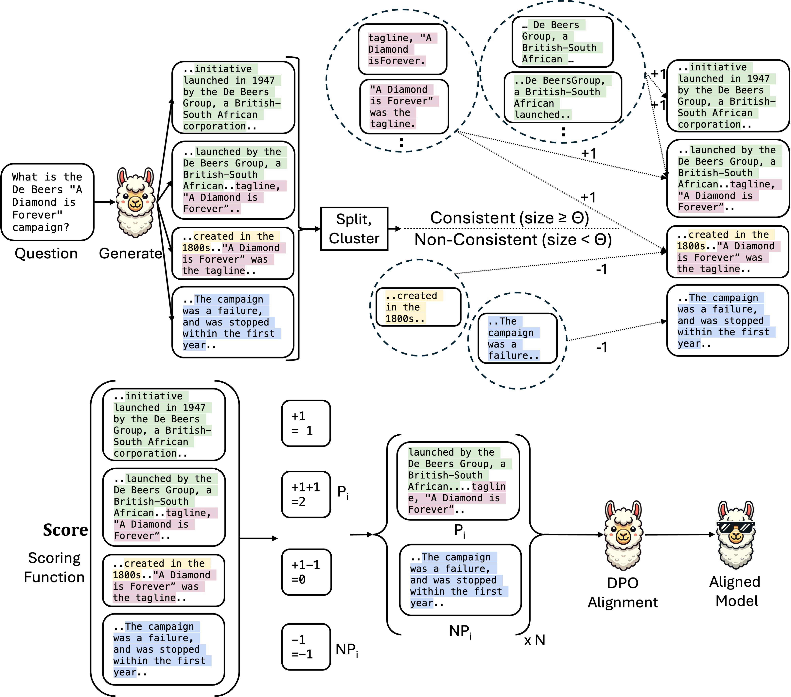

# Atomic Consistency Preference Optimization (ACPO)
This is the official repo for the paper "Atomic Consistency Preference Optimization for Long-Form Question Answering".

## Abstract
Large Language Models (LLMs) frequently produce factoid hallucinations—plausible yet incorrect answers.  A common mitigation strategy is model alignment, which improves factual accuracy by training on curated (non-factual, factual) pairs.  However, this approach typically depends on a more powerful model (e.g., GPT-4) or a retriever-augmented knowledge base to identify factual inconsistencies.  These dependencies make it impractical in many scenarios, particularly in low-resource domains where access to such models or external knowledge sources is limited.  To address these challenges, we propose Atomic Consistency Preference Optimization (ACPO), a self-supervised preference-tuning method that enhances factual accuracy without external supervision.  ACPO leverages atomic consistency signals to identify high- and low-quality data pairs for Direct Preference Optimization (DPO) training.  By refining LLM outputs through self-consistency rather than external annotations, ACPO offers a scalable and efficient alternative for improving factoid question-answering.  Empirical results show that, despite being self-supervised, ACPO outperforms FactAlign—a strong supervised alignment baseline—on LongFact and BioGen datasets by +1.95 points, underscoring its ability to enhance factual reliability without dependence on external models or knowledge bases.

## Environment Setup
We recommend creating a clean Conda environment to run this project:
### Create and activate a new Conda environment
conda create -n acpo python=3.9  

conda activate acpo

### Install required dependencies
pip install -r requirements.txt  

### Download necessary NLTK data
python -m nltk.downloader punkt  

## Results
### FactScore Accuracy

| **Method**       | **LongFact Score** | **#Claim** | **BioGen Score** | **#Claim** |
|------------------|--------------------|------------|------------------|------------|
| **Llama-3-8B**                                                               
| RawModel         | 79.8               | 121.2      | 55.9             | 61.0       |
| FactAlign        | **83.3**           | 119.9      | 57.1             | 56.7       |
| ACPO             | 82.1               | **143.8**  | **58.0**         | **68.0**   |
| **Phi3-mini**                                                                
| RawModel         | 78.0               | 90.2       | 41.7             | 88.4       |
| FactAlign        | 81.2               | 113.8      | 47.1             | 100.9      |
| ACPO             | **84.6**           | 70.7       | **51.8**         | 67.1       |

**Note:** *ACPO*, our self-supervised method, outperforms the strong supervised baseline *FactAlign* in **3 out of 4 settings**, achieving an average gain of **+1.95** in factual precision.

🛠️ Environment Setup
We recommend creating a clean Conda environment:

conda create -n acpo python=3.9
conda activate acpo
pip install -r requirements.txt
python -m nltk.downloader punkt

Repository Structure
ACPO/
├── Data-Generation/           # Answer generation, clustering, and scoring
├── DPO-Tuning/                # DPO training implementation
├── Evaluation/                # FActScore evaluation tools
├── generate_dpo_pairs.py      # Main data generation pipeline
├── train.py                   # DPO training entry point
└── requirements.txt           # Python dependencies

